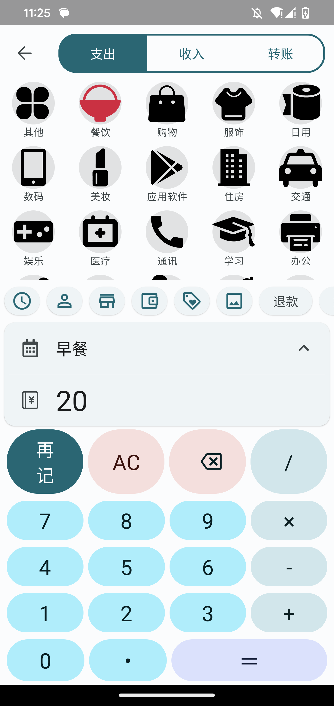
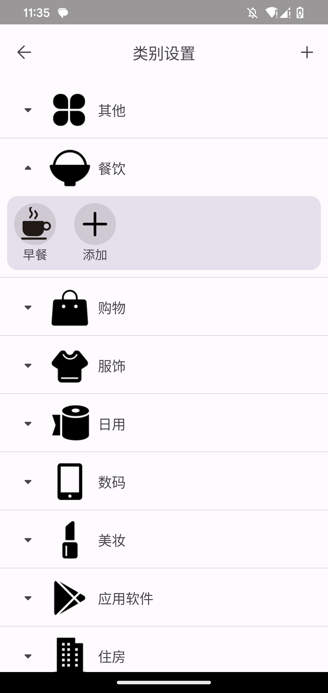
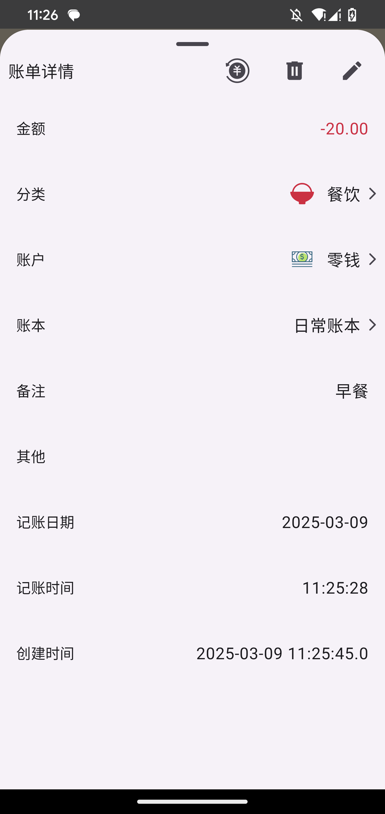
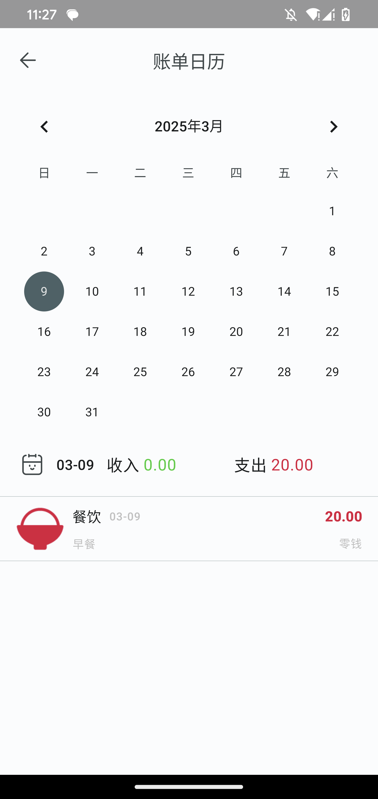
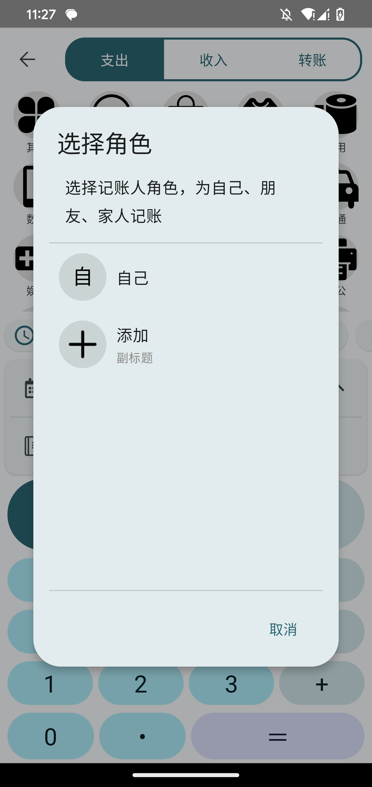
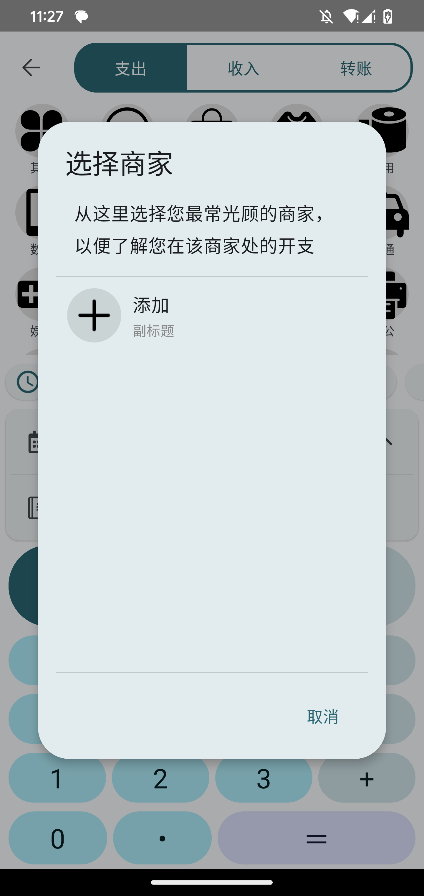
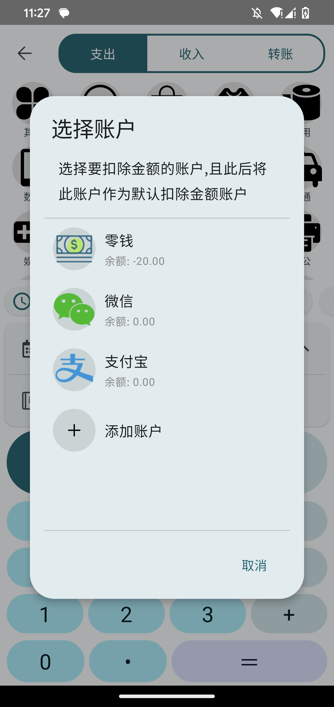
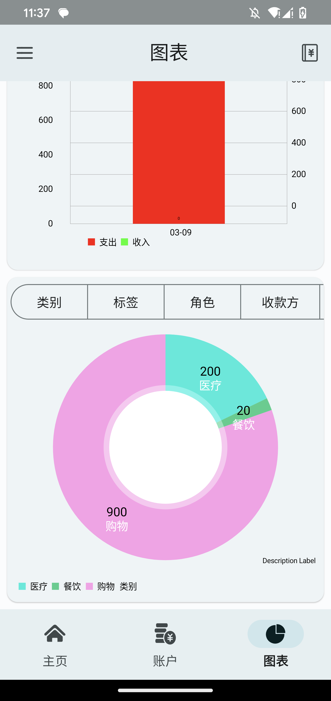
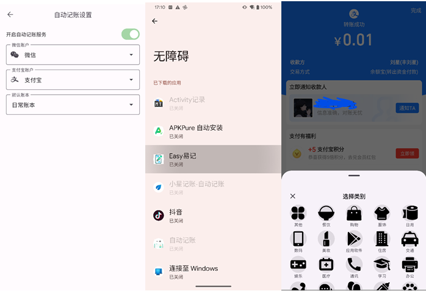

# Easy - Keeping 易记

Android 记账软件

2023.6 毕业设计归档

# 主要功能

## 1. 分类记账

可以通过类别管理，添加二级类别

## 2. 账单详情

## 3. 账本管理

## 4. 账单日历

## 5. 记账角色

## 6. 商家管理

## 7. 账户管理

## 8. 账单标签

## 9. 图表

## 10. 自动记账
